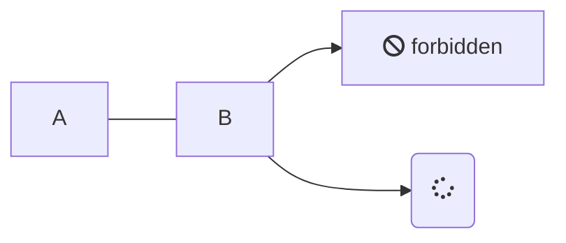

# Examples

## Code embedding

```py
--8<-- "docs/tips/123.py"
```

## mermaid diagram



## Mermaid #2


<!DOCTYPE html>

<html lang="en">
<head>
  <meta charset="utf-8">
</head>
<body>
  <div class="mermaid">
  graph LR
      A --- B
      B-->C[fa:fa-ban forbidden]
      B-->D(fa:fa-spinner);
  </div>
 <script src="/shared/mermaid.min.js"></script>
 <script>mermaid.initialize({startOnLoad:true});
</script>
</body>
</html>
